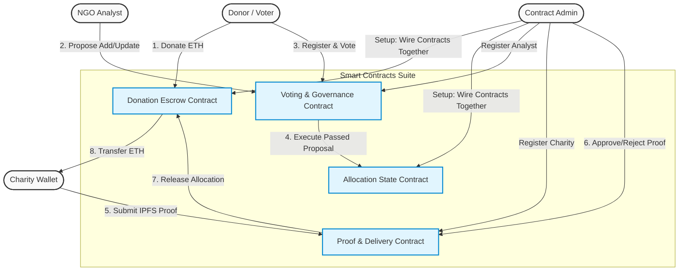

# 🌟 Samaritan Chain dApp

[](https://react.dev/)
[](https://vitejs.dev/)
[](https://docs.ethers.org/v6/)
[](https://soliditylang.org/)
[](#)

A beautiful, premium Web3 dApp for the **Samaritan Chain** project. This frontend provides an interactive interface to coordinate and manage a four-contract charity escrow, allocation, voting, and delivery validation framework.

---

## 📖 Table of Contents
1. [Overview & Concept](#-overview--concept)
2. [System Architecture](#-system-architecture)
3. [Smart Contracts Suite](#-smart-contracts-suite)
4. [Roles & Actor Walkthrough](#-roles--actor-walkthrough)
5. [Step-by-Step Deployment & Setup Flow](#-step-by-step-deployment--setup-flow)
6. [Interactive E2E Demo Script](#-interactive-e2e-demo-script)
7. [Frontend Interface Panels](#-frontend-interface-panels)
8. [Local Development Setup](#-local-development-setup)

---

## 💡 Overview & Concept

Traditional charity systems often operate as a "black box" where donors have zero visibility into how their funds are allocated or if they are successfully delivered. 

**Samaritan Chain** solves this problem by introducing decentralized governance and evidence-based milestone verification:
*   **Decentralized Escrow:** Donated funds are locked securely within a trustless escrow contract.
*   **Democratic Allocations:** Allocations are not hardcoded; they are proposed by vetted **NGO Analysts** and voted on by **Donors**.
*   **Milestone-Based Releases:** Charities cannot simply withdraw funds. They must submit **Proof of Delivery** (e.g., IPFS hashes of receipts, reports, or photos) which is audited and approved by the **Admin** before a percentage of funds is released.

---

## 📐 System Architecture

The following diagram details the interactions between the four core smart contracts and the distinct system actors (Donors, Analysts, Charities, and Admin):



---

## 🔒 Smart Contracts Suite

The dApp coordinates four smart contracts acting in harmony:

1.  **`DonationContract`**: Acts as the central vault/escrow holding all donated funds. It receives donations and holds them securely until a verified delivery event triggers a payout.
2.  **`AllocationContract`**: The ledger of records. It tracks all registered charities, whether they are active, and their assigned allocation percentage (e.g. 20% of the escrow pool).
3.  **`VotingContract`**: Governs proposals to add new charities or modify percentages. It allows analysts to make proposals and registered donors to vote. Once a proposal passes its deadline and receives a majority, it can be executed to update the `AllocationContract`.
4.  **`DeliveryContract`**: Controls the release of funds. Registered charities submit milestone proof (IPFS evidence URIs). When the Admin validates and approves a submission, this contract instructs the `DonationContract` to release the charity's proportional share of the escrow pool directly to their wallet.

---

## 👥 Roles & Actor Walkthrough

To perform a complete demo of the dApp, you should set up and toggle between different MetaMask accounts representing the four roles:

| Role | Responsibility | UI Capabilities | Recommended Demo Prep |
| :--- | :--- | :--- | :--- |
| **Admin / Deployer** | Contract Owner & Validator | Wire contracts together, register authorized Analysts, register charity wallets, and validate/approve submitted evidence. | Account that deploys the contracts on Remix (has `onlyOwner` privileges). |
| **NGO Analyst** | Proposal Creator | Submit proposals to either **Add a new charity** (defining name, wallet, and percentage) or **Update an allocation percentage** for an existing charity. | Must be registered by the Admin via the Admin Panel. |
| **Donor / Voter** | Funding & Governance | Register as a voter, donate ETH into the escrow vault, and cast votes (**FOR** or **AGAINST**) on active proposals. | Any general MetaMask account. Can have multiple donors (e.g., Donor 1, Donor 2). |
| **Charity** | Field Delivery | Submit evidence of work (IPFS hash or evidence URI) linked to their Charity ID to request a milestone payout. | Wallet must be registered by the Admin via the Admin Panel. |

---

## ⚙️ Step-by-Step Deployment & Setup Flow

Follow this precise sequence to spin up and connect the system:

### 1. Contract Deployment in Remix
Deploy the contracts in **Remix IDE** (using the `Injected Provider - MetaMask` or a Local Hardhat/Anvil node). Because the contracts reference each other, **you must deploy them in this exact order**:

1.  **`DonationContract`** — Deployed with *no constructor arguments*.
2.  **`AllocationContract`** — Deployed with *one constructor argument*: the address of the deployed `DonationContract`.
3.  **`VotingContract`** — Deployed with *one constructor argument*: the address of the deployed `AllocationContract`.
4.  **`DeliveryContract`** — Deployed with *one constructor argument*: the address of the deployed `AllocationContract`.

### 2. Configure the dApp Setup Panel
1.  Launch the dApp locally (see [Local Development Setup](#-local-development-setup)).
2.  Connect your MetaMask wallet (use the **Admin/Deployer** account).
3.  In the initial **Contract Addresses** panel, paste the four addresses you copied from Remix into their respective input boxes.
4.  Click **Load Contracts**. *(The dApp will save these addresses to your browser's local storage so you don't lose them on page refresh).*

### 3. Wire (Couple) the Contracts Together
Before the contracts can interact, you must give them mutual permissions.
1.  Ensure you are connected with the **Admin/Deployer** wallet.
2.  Locate the **Admin Operations** panel.
3.  Click the **Wire Contracts Together** button.
4.  MetaMask will prompt you for three transactions in sequence:
    *   `DonationContract.setAllocationContract(...)`
    *   `AllocationContract.setVotingContract(...)`
    *   `AllocationContract.setDeliveryContract(...)`
5.  Wait for all three transactions to complete. The status bar will show "Contracts wired successfully!".

---

## 🚀 Interactive E2E Demo Script

Once setup is complete, follow this script to demo a full cycle of charity funding, governance, and milestone delivery:

### Step 1: Donor Contribution
1.  Switch MetaMask to a **Donor** account.
2.  On the **Donor Panel**, click **Register as Donor** and approve the transaction.
3.  Under *Donation Amount*, input `0.5` (ETH) and click **Donate**. Approve the transaction.
4.  Click **Refresh Data** on the Dashboard. You will see the **Escrow Balance** is now `0.5 ETH`, and **Your Contributions** is `0.5 ETH`.

### Step 2: Register an Analyst & Charity (Admin Action)
1.  Switch MetaMask back to the **Admin/Deployer** account.
2.  Switch to a second test account in MetaMask, copy its address (this will be our **Analyst**), then switch back to Admin.
3.  In the **Admin Panel** under *Access Control*, paste the Analyst address into *Analyst Wallet Address* and click **Register Analyst**. Approve the transaction.
4.  Switch to a third test account in MetaMask, copy its address (this will be our **Charity**), then switch back to Admin.
5.  In the **Admin Panel**, paste the Charity address into *Charity Wallet Address* and click **Register Charity Wallet**. Approve the transaction.

### Step 3: Propose a New Charity (Analyst Action)
1.  Switch MetaMask to the registered **Analyst** account.
2.  In the **Analyst Panel** under *Propose New Charity*, enter:
    *   **Charity Name:** e.g., `UNICEF`
    *   **Charity Wallet:** The address of the Charity you registered in Step 2.
    *   **Percentage:** `20` *(representing 20% of the Escrow vault)*.
3.  Click **Submit Add Proposal** and approve the transaction.
4.  Note down the proposal ID (typically `0` for the first proposal).

### Step 4: Cast Votes (Donor Action)
1.  Switch MetaMask to the **Donor** account.
2.  In the **Donor Panel** under *Proposal ID to Vote On*, enter `0` (or the proposal ID).
3.  Click **Vote FOR** and approve the transaction.
4.  *(Optional)* Switch to another registered donor and vote as well.

### Step 5: Execute the Proposal (Governance Resolution)
*Note: Depending on your Solidity configuration, you may need to wait for the voting deadline to pass (e.g., 2 minutes or 24 hours depending on the contract's block times).*
1.  In the **Proposal Execution** panel, enter Proposal ID `0` and click **Load Proposal** to check the status.
2.  Once the deadline has passed, click **Execute Proposal** and approve the transaction.
3.  Click **Refresh Data** on the Dashboard. You will notice that **Total Charities** has incremented to `1`.

### Step 6: Submit Milestone Proof (Charity Action)
1.  Switch MetaMask to the **Charity** account.
2.  The dApp will automatically detect that this account is a registered charity, display a green check badge, and auto-fill their **Charity ID** (usually `0`).
3.  Input an *Evidence URI* (e.g., `ipfs://QmXyZ123...` representing delivery documents).
4.  Click **Submit Proof** and approve the transaction.
5.  Note the **Submission ID** shown in the toast or panel status (typically `0`).

### Step 7: Validate & Payout (Admin Action)
1.  Switch MetaMask back to the **Admin/Deployer** account.
2.  In the **Admin Panel** under *Validate Proof Submissions*, input the Submission ID `0`.
3.  Click **Accept & Release Funds** and approve the transaction.
4.  **Result:** The smart contracts calculate `20%` of the `0.5 ETH` escrow balance (`0.1 ETH`) and transfer it instantly from the `DonationContract` vault directly to the Charity's wallet.
5.  Refresh the Dashboard. The escrow balance will decrease to `0.4 ETH`, and the charity's wallet balance will increase by `0.1 ETH`!

---

## 🖥️ Frontend Interface Panels

The frontend is built using a modern, interactive design system featuring:

*   **Setup Panel:** Configure and check contract address formatting before mounting the main app.
*   **Dashboard Panel:** Real-time state metrics direct from the blockchain showing the Escrow Balance, User Contributions, and global counters.
*   **Donor Panel:** A unified area for registering as a donor, initiating ETH transfers, and casting governance votes.
*   **Analyst Panel:** Specialized tools for creating charity onboarding or percentage modification proposals.
*   **Charity Panel:** Features **Auto-Profile Detection**, displaying active escrow shares and live wallet balances for registered charity accounts.
*   **Proposal Execution Panel:** Inspects detailed proposal records (type, wallet, proposed share, vote tally, deadline) and executes closed proposals.
*   **Data Lookup Panel:** An auditing area to fetch read-only details of any Charity ID or Proof Submission ID on the blockchain.
*   **Micro-Animation & Toast System:** Interactive custom toast popups detailing the progress of in-flight Ethereum transactions (Info, Success, Warning, Error states).

---

## 🛠️ Local Development Setup

To run this React/Vite dApp locally, ensure you have [Node.js](https://nodejs.org/) installed, and then run:

```bash
# 1. Install dependencies
npm install

# 2. Start the local Vite development server
npm run dev
```

The dApp will run locally at:
👉 **[http://localhost:5173](http://localhost:5173)**

---

*Developed with ❤️ for the IFB452 Group Project.*
